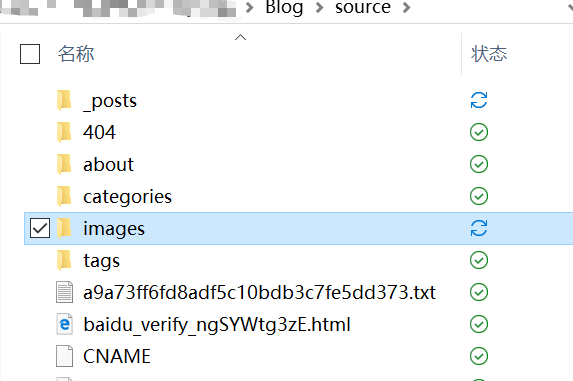
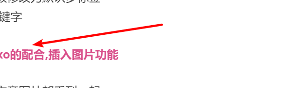

今晚折腾总结

<!--more-->

# 实现的功能.

## post 模板修改

1. copyright 默认为true
2. tags 标签模板修改为默认多标签
3. 加入more关键字

## typora和hexo的配合,插入图片功能

目前是把所有的文章图片都丢到一起.

查看网文,有人也和我.

# 遗留问题

1. typora&hexo目前都没有完美的办法放到单个文章对应的目录下面.

2. 右下角动画按照[这位兄台](http://zhixiangliu.com/2018/05/06/20180506/)的修改

3. 留言系统也要按照[这位兄台](http://zhixiangliu.com/2018/05/06/20180506/)的修改